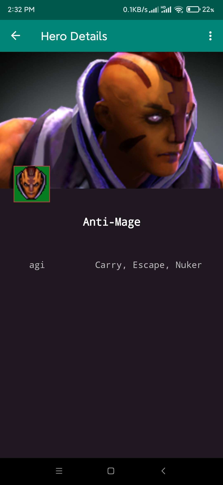
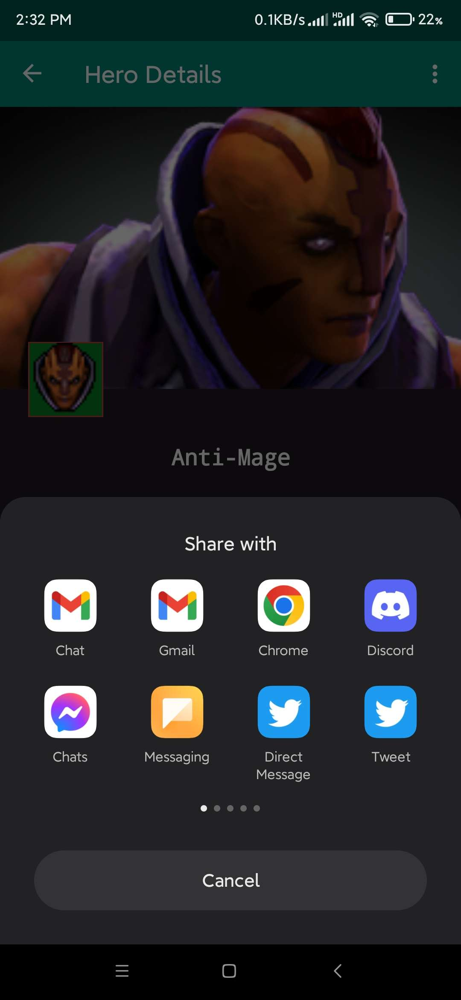
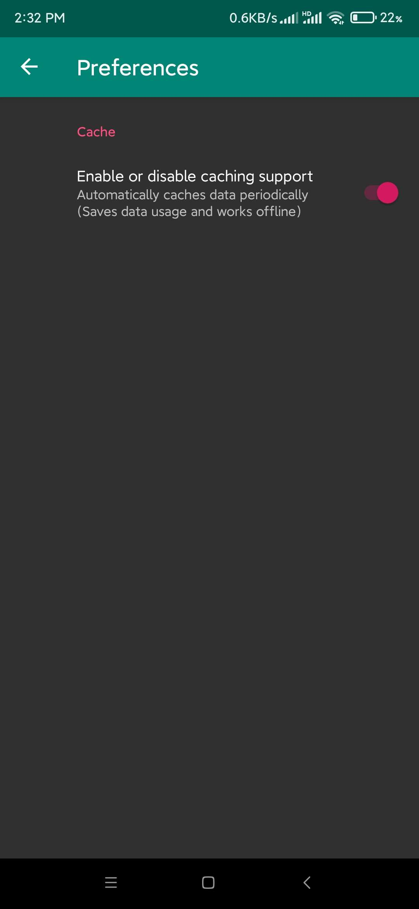

# Android Jetpack

This project uses several Android Jetpack libraries, which are a collection of libraries that help developers follow best practices, reduce boilerplate code, and write code that works consistently across Android versions and devices.

## MVVM Architecture

The project also uses the MVVM architecture which separates the UI code from the business logic and data modeling. This separation of concerns makes the codebase easier to manage and test.

Here's a snippet of how a ViewModel was implemented here:

```kotlin
class HeroViewModel(
    application: Application,
    private val heroRepository: HeroRepository
) : BaseViewModel(application) {

    private val _heroList = MutableLiveData<List<Hero>>()
    ...
}
```

### LiveData

LiveData is used for data observation between the ViewModel and the UI. LiveData ensures that the UI matches the data state and allows automatic updates on the UI upon data state change.

```kotlin
val heroList: LiveData<List<Hero>>
    get() = _heroList
```

## Coroutines

Kotlin Coroutines are used for handling asynchronous tasks, replacing callback-based APIs with a simpler linear code that is easier to read and maintain.

```kotlin
launch {
    try {
        ensureActive()
        val dao = HeroDatabase(getApplication()).heroDao()
        val heroList = dao.getAll()
        ...
    }
}
```

## Room Database

Room is used as an abstraction layer over SQLite. It makes it easier to work with databases in Android. Room takes care of boilerplate code and allows for more compile-time checks of SQL queries.

```kotlin
@Dao
interface HeroDao {
    @Insert(onConflict = OnConflictStrategy.REPLACE)
    suspend fun insert(hero: Hero)
    ...
}
```

## Retrofit and RxJava

Retrofit is used for network calls, while RxJava manages background tasks and allows for handling data streams more effectively.

```kotlin
class HeroRepository(private val scheduler: Scheduler = Schedulers.newThread()) {
    fun fetchHeroes(): Single<List<Hero>> {
        return heroService.getHeroes()
            .subscribeOn(scheduler)
            .observeOn(AndroidSchedulers.mainThread())
    }
}
```

## View Binding

View binding is used to create direct references to views, which eliminates the need for `findViewById()`. View binding can make code more concise, efficient, and safer with compile-time checks to prevent null pointer exceptions.

Example:

```kotlin
class MainActivity : AppCompatActivity() {
    private lateinit var binding: ActivityMainBinding

    override fun onCreate(savedInstanceState: Bundle?) {
        super.onCreate(savedInstanceState)
        binding = ActivityMainBinding.inflate(layoutInflater)
        val view = binding.root
        setContentView(view)
    }
}
```

## Data Binding

Data Binding is used to declaratively bind UI components in layouts to data sources, reducing boilerplate code.

```xml
<ImageView
    android:id="@+id/hero_image"
    android:layout_width="wrap_content"
    android:layout_height="wrap_content"
    android:imageUrl="@{hero.iconUrl}" />
```

## Navigation Component

The Navigation component from Android Jetpack is used to simplify navigation between different screens (fragments) of the app.

```kotlin
val action = HeroFragmentDirections.actionHeroFragmentToDetailsFragment(hero.id)
navController.navigate(action)
```

### Safe Args

The Safe Args plugin for navigation is used to pass data between destinations. It generates simple object and builder classes for type-safe access to arguments specified for destinations and actions.

We retrieve the passed `heroId` safely:

```kotlin
val args: DetailsFragmentArgs by navArgs()
val heroId = args.heroId
```

This ensures type safety and prevents potential crashes due to incorrect data types or missing data when navigating between destinations.

## Kotlin Extension Functions

Kotlin extension functions are used to extend the functionality of classes without having to touch their code. This project includes several extension functions that streamline common tasks. For instance, the `Drawable.kt` and `Image.kt` files contain extension functions for easier image loading and processing.

Example from `Image.kt`:

```kotlin
fun ImageView.loadImage(uri: String?, progressDrawable: CircularProgressDrawable) {
    val options = RequestOptions()
        .placeholder(progressDrawable)
        .error(R.mipmap.dota2_symbol)

    Glide.with(context)
        .setDefaultRequestOptions(options)
        .load(uri)
        .into(this)
}
```

## Preferences (Settings)

The Android Preferences API is used to store and manage user preferences. This is demonstrated in the `Prefs` utility class and the `SettingsFragment` that uses the `PreferenceFragmentCompat` to create a settings screen from XML.

```xml
<PreferenceScreen xmlns:app="http://schemas.android.com/apk/res-auto">
    <PreferenceCategory app:title="Cache">
        <SwitchPreferenceCompat
            app:key="caching_enabled"
            app:defaultValue="@bool/caching_enabled"
            app:summaryOff="Always calls the backend for fresh information."
            app:summaryOn="Automatically caches data periodically."
            app:title="Enable or disable caching support" />
    </PreferenceCategory>
</PreferenceScreen>
```

## SharedPreferences

The `Prefs` singleton class in `Prefs.kt` provides a neat encapsulation for `SharedPreferences`. It provides a simple API to get and set values, such as saving the last update time and retrieving it, and checking if caching is enabled. This is a good example of the encapsulation principle in SOLID design principles.

```kotlin
class Prefs {
    ...
    fun saveUpdateTime(time: Long) { ... }
    fun getUpdateTime() = prefs?.getLong(PREF_SAVE_TIME, 0) ?: 0
    fun getIsCachingEnabled() = prefs?.getBoolean("caching_enabled", false)
    ...
}
```

## Notifications

`Notifs.kt` shows a good practice for building and displaying a notification. It encapsulates the details of creating a notification, including creating the notification channel, building the notification, and showing it.

```kotlin
class Notifs(val context: Context) {
    ...
    fun createNofitication() { ... }
    private fun createNotificationChannel() { ... }
}
```

## DiffUtil

In `HeroDiffCallback.kt`, the `DiffUtil.Callback` is used to efficiently update a `RecyclerView`. It checks the difference between an old list and a new list and triggers updates for items that have changed or moved. This is a great way to improve the performance of a `RecyclerView`.

```kotlin
class HeroDiffCallback(
    private val oldList: List<Hero>,
    private val newList: List<Hero>
) : DiffUtil.Callback() { ... }
```

## Sharing Intent

Android's built-in sharing intent (`Intent.ACTION_SEND`) is used to share text and streaming media to other apps. This is demonstrated in the `DetailsFragment`, where users can share hero details with others.

```kotlin
val intent = Intent(Intent.ACTION_SEND)
intent.type = "text/plain"
intent.putExtra(Intent.EXTRA_SUBJECT, "Check out this hero!")
intent.putExtra(Intent.EXTRA_TEXT, "Hero details here...")
startActivity(Intent.createChooser(intent, "Share with"))
```

## Palette

The Android Palette library is used to extract prominent colors from images, which can be used to create more visually appealing UIs. The palette is used in the `DetailsFragment` to extract colors from hero images and apply them to the layout background.

## Design Patterns & Best Practices

This Android application project demonstrates several best practices and design patterns in Android development. Below are some of the main ones:

### Model-View-ViewModel (MVVM)

The MVVM design pattern is used to separate the application's user interface logic from the business logic. In this pattern:

- The **Model** represents the data and business logic of the application. In this project, the Model includes data classes such as `Hero` and data handling classes such as `HeroRepository`.
- The **View** represents the user interface and its components. In this project, the View is implemented in classes such as `HeroFragment` and `DetailsFragment`.
- The **ViewModel** acts as a link between the Model and the View. It's responsible for transforming the data from the Model into a form that can be easily displayed in the View. For example, `HeroViewModel` and `DetailsViewModel` in this project.

```kotlin
class HeroViewModel(application: Application, private val heroRepository: HeroRepository) : BaseViewModel(application) {
    ...
}
```

### Repository Pattern

The Repository pattern is used to abstract away the details of data retrieval. It acts as a middleman between the different data sources (like databases and network calls) and the rest of the application. This pattern allows for cleaner and more modular code, and makes it easier to add, remove, or switch between different data sources. An example in this project is the `HeroRepository`.

```kotlin
class HeroRepository(private val scheduler: Scheduler = Schedulers.newThread()) {
    private val heroService = HeroService()

    fun fetchHeroes(): Single<List<Hero>> {
        return heroService.getHeroes()
            .subscribeOn(scheduler)
            .observeOn(AndroidSchedulers.mainThread())
    }
}
```

### Dependency Injection

While not implemented with a specific library like Dagger or Hilt, this project utilizes the principle of Dependency Injection. This principle is most evident in how the `HeroRepository` is passed as a parameter when instantiating `HeroViewModel`.

```kotlin
viewModel = ViewModelProvider(this, ViewModelFactory()).get(HeroViewModel::class.java)
```

This allows for better modularity, easier testing, and reduced coupling between classes.

Absolutely, this is another good example of Kotlin's extension functions and data binding in action.

### Data Binding & Extension Functions

The project uses the `@BindingAdapter` annotation from the Data Binding library to create a custom attribute (`android:imageUrl`) that can be used in the XML layout files. This attribute is bound to the `loadImage` function which is an extension function on `ImageView`. This function uses Glide to load an image from a URL into an `ImageView`, showing a circular progress drawable while the image is loading. This makes it much easier and cleaner to load images from a URL into an `ImageView` directly from the XML layout.

Here is the function:

```kotlin
@BindingAdapter("android:imageUrl")
fun loadImage(view: ImageView, url: String?) {
    view.loadImage(url, getProgressDrawable(view.context))
}
```

In the layout file, you would use it like this:

```xml
<ImageView
    ...
    android:imageUrl="@{hero.fullImageUrl}"
    ... />
```

This approach leverages the power of Kotlin's extension functions and Android's Data Binding to reduce boilerplate and improve readability.

### Kotlin Coroutines

This project uses Kotlin Coroutines for handling asynchronous tasks, such as database and network operations. Coroutines allow for simpler and more readable asynchronous code, by avoiding callback hell and allowing for straightforward error handling.

### Usage of Android Jetpack Libraries

This project uses several Android Jetpack libraries, which are a collection of libraries that help developers follow best practices, reduce boilerplate code, and write code that works consistently across Android versions and devices. These libraries include:

- **Room**: For data persistence.
- **ViewModel and LiveData**: For lifecycle-aware data storage and observation.
- **Data Binding and View Binding**: For declarative layout and UI code reduction.
- **Navigation Component**: For easier navigation and argument passing between fragments.
- **Preferences**: For user settings.
- **Palette**: For dynamic color extraction from images.

By following these and other best practices and design patterns, this project aims to be a highly maintainable, testable, and scalable Android application.

## Dependency List

### build.gradle **(module: app)**

1. `androidx.navigation:navigation-fragment-ktx` and `androidx.navigation:navigation-ui-ktx`: These dependencies are used for Android Jetpack's Navigation component, which helps in implementing navigation between different screens (fragments) of an app. It also includes support for deep links and safe args. It's part of Android Jetpack.

2. `androidx.lifecycle:lifecycle-livedata-ktx` and `androidx.lifecycle:lifecycle-viewmodel-ktx`: These are part of the Android Jetpack's Lifecycle components which help you produce code that's easier to test and maintain. LiveData is an observable data holder class, and ViewModel allows data to survive configuration changes such as screen rotations. They are part of Android Jetpack.

3. `androidx.room:room-runtime`, `androidx.room:room-ktx`, `androidx.room:room-compiler`: Room is a persistence library that provides an abstraction layer over SQLite and allows for more robust database access while harnessing the full power of SQLite. It is part of Android Jetpack.

4. `androidx.core:core-ktx`, `androidx.appcompat:appcompat`, `androidx.constraintlayout:constraintlayout`, `androidx.swiperefreshlayout:swiperefreshlayout`, `androidx.palette:palette-ktx`, `androidx.preference:preference-ktx`: These are part of Android Jetpack's foundational components. They provide backwards compatibility and other features for UI design, accessibility, and data management.

5. `com.google.android.material:material`: This library provides Material Design components for Android apps, allowing for UI designs that adhere to the latest Material Design specifications.

6. `com.squareup.retrofit2:retrofit`, `com.squareup.retrofit2:converter-gson`, `com.squareup.retrofit2:adapter-rxjava3`: Retrofit is a type-safe HTTP client for Android and Java. The Gson converter is used for parsing JSON responses, and the RxJava adapter allows it to return RxJava 3.x types.

7. `io.reactivex.rxjava3:rxandroid`, `io.reactivex.rxjava3:rxjava`: RxJava and RxAndroid are libraries for composing asynchronous and event-based programs using observable sequences. They are not part of Android Jetpack.

8. `com.github.bumptech.glide:glide`: Glide is a fast and efficient image loading library for Android that wraps media decoding, memory and disk caching, and resource pooling into a simple and easy to use interface. It's not part of Android Jetpack.

### build.gradle **(Project: Jetpack)**

1. `androidx.navigation:navigation-safe-args-gradle-plugin`: This Gradle plugin generates simple object and builder classes for type-safe access to arguments specified for destinations and actions.

2. `com.android.application`, `com.android.library`: These are Android Gradle plugins for building Android app modules and library modules.

3. `org.jetbrains.kotlin.android`: This is the Kotlin Gradle plugin for Android, which allows you to write your app's code in Kotlin.

4. `androidx.navigation.safeargs`: This is the safe args Gradle plugin for the Navigation component, it generates simple object and builder classes for type-safe access to arguments specified for destinations and actions. It is part of Android Jetpack.

The versions of these libraries (`lifecycle_version`, `room_version`, `nav_version`) are defined in the `buildscript` section of the `build.gradle` file.

## Screenshots

<p align="middle">
    
    
    
    
    
</p>